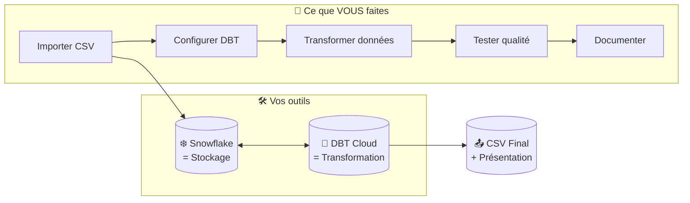
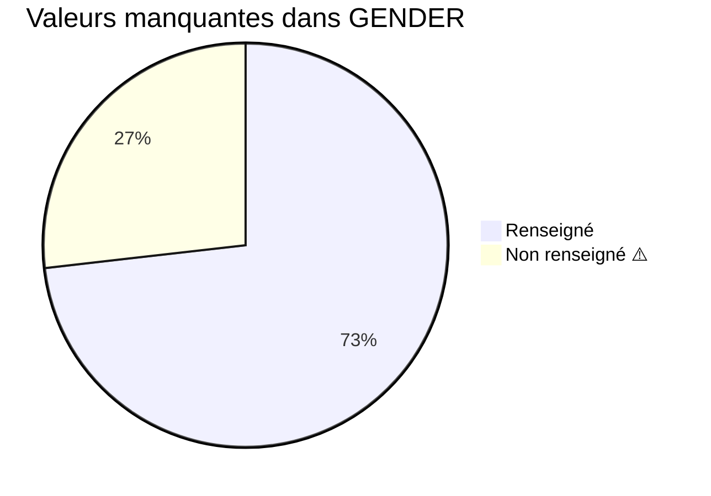
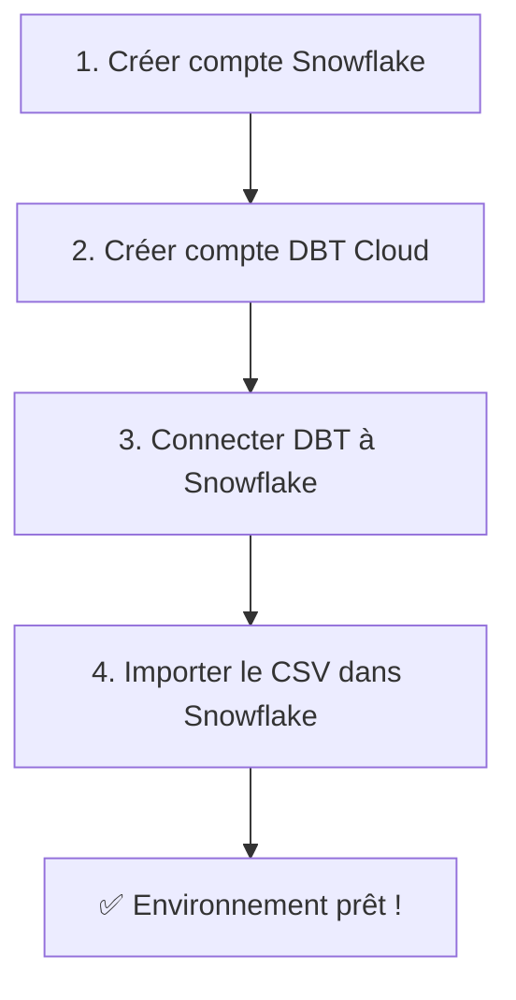
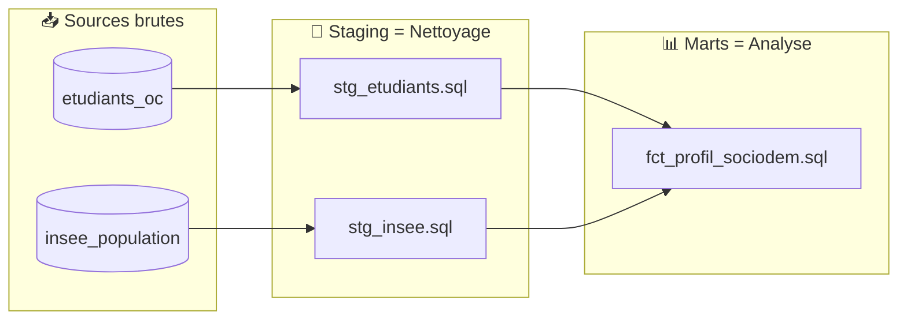
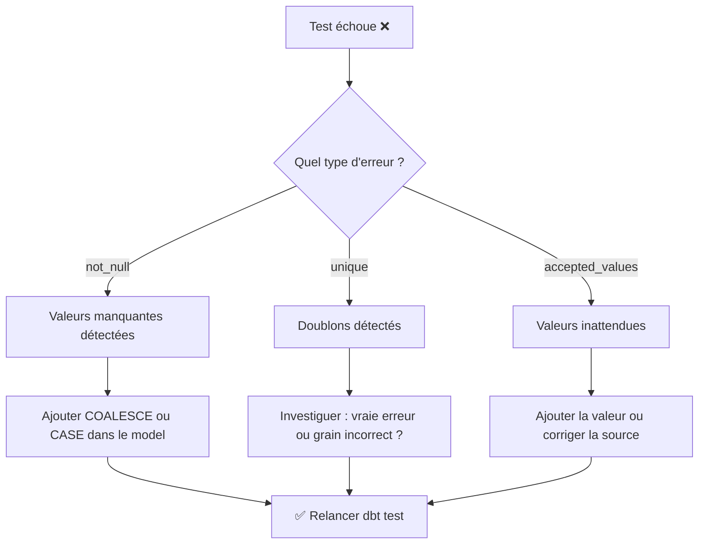
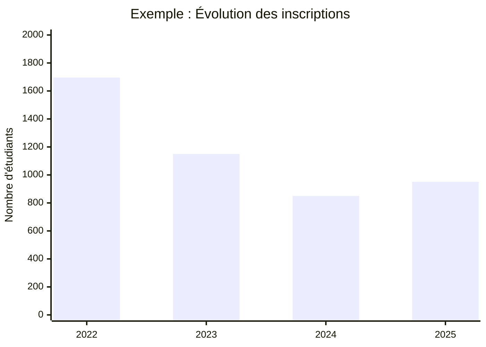

 🎓 Projet P8 - Guide Étudiant
## Analyser l'évolution du profil sociodémographique des étudiants Data d'OpenClassrooms

---

## 🎯 Votre Mission en Bref

> Vous êtes **Data Analyst junior** chez OpenClassrooms. Marie-Neige Martin, Lead Data Analyst, vous confie une mission : analyser l'évolution du profil sociodémographique des étudiants des parcours Data sur 4 ans (2022-2025).

### Ce que vous allez produire

| Livrable | Format | Description |
|----------|--------|-------------|
| 📄 **Données consolidées** | CSV | Jeu de données nettoyé et enrichi |
| 🔧 **Pipeline DBT** | Projet DBT | Workflow documenté avec tests |
| 📊 **Présentation** | PDF (~15 slides) | Méthodologie + Résultats + Recommandations |

---

## 🏗️ Comment ça Fonctionne ?



### 💡 Comprendre Snowflake et DBT

| Outil | Rôle | Analogie |
|-------|------|----------|
| **Snowflake** | Stocke vos données brutes | 📦 L'entrepôt qui garde vos cartons |
| **DBT** | Transforme et nettoie les données | 🔧 L'atelier qui trie et organise |

> ⚠️ **Important** : DBT ne stocke rien ! Il lit les données dans Snowflake, les transforme, et écrit le résultat dans Snowflake.

---

## 📊 Vos Données de Départ

### Le Dataset (4 646 étudiants)

| Colonne | Ce que c'est | Exemple |
|---------|--------------|---------|
| `USER_ID` | Identifiant unique | U-4510146189133097827 |
| `PATH_CATEGORY_NAME` | Catégorie du parcours | Data |
| `AGE_GROUP` | Tranche d'âge | 30-34 ans |
| `GENDER` | Genre déclaré | F, M ou *vide* |
| `REGION` | Région de résidence | Île-de-France |
| `YEAR_PATH_STARTED` | Année de début | 2023 |

### ⚠️ Problèmes à Traiter



| Problème | Impact | Votre action |
|----------|--------|--------------|
| **27% de GENDER vides** | Analyse biaisée | Documenter le choix (exclure ou catégorie "Non renseigné") |
| **Orthographe régions** | Jointure INSEE échoue | Harmoniser "Centre-Val de Loire" |

---

## 🚀 Les 5 Étapes du Projet

### Étape 1 : Préparation de l'environnement



**À faire :**
- [ ] Créer un compte Snowflake (essai gratuit)
- [ ] Créer un compte DBT Cloud (gratuit, 1 projet)
- [ ] Suivre le [Quick Start DBT + Snowflake](https://docs.getdbt.com/guides/snowflake)
- [ ] Importer `DATASET_P8.csv` dans Snowflake

---

### Étape 2 : Déclarer vos sources dans DBT

**Pourquoi ?** DBT doit savoir où trouver vos données brutes.

**Fichier `models/sources.yml` :**

```yaml
version: 2

sources:
  - name: raw_data
    description: "Données brutes importées dans Snowflake"
    database: VOTRE_DATABASE    # À remplacer
    schema: PUBLIC              # À adapter
    tables:
      - name: etudiants_oc
        description: "Données sociodémographiques des étudiants Data OC"
        columns:
          - name: USER_ID
            description: "Identifiant technique unique de l'étudiant"
          - name: PATH_CATEGORY_NAME
            description: "Catégorie du parcours suivi (Data)"
          - name: AGE_GROUP
            description: "Classe d'âge au moment du début du parcours"
          - name: GENDER
            description: "Genre déclaré par l'étudiant (F/M ou vide)"
          - name: REGION
            description: "Région de résidence"
          - name: YEAR_PATH_STARTED
            description: "Année de début du parcours"
```

**Vérifier que ça marche :**
```bash
dbt debug    # Vérifie la connexion
dbt source freshness  # Vérifie l'accès aux sources
```

---

### Étape 3 : Créer vos Models (Transformations)



#### Model 1 : Nettoyage des données étudiants

**Fichier `models/staging/stg_etudiants.sql` :**

```sql
-- Nettoyage et standardisation des données étudiants
-- Gestion des valeurs manquantes dans GENDER

WITH source AS (
    SELECT * FROM {{ source('raw_data', 'etudiants_oc') }}
),

cleaned AS (
    SELECT
        USER_ID,
        PATH_CATEGORY_NAME,
        AGE_GROUP,
        -- Gestion des valeurs manquantes
        CASE 
            WHEN GENDER IS NULL OR GENDER = '' THEN 'Non renseigné'
            ELSE GENDER 
        END AS GENDER,
        -- Harmonisation des noms de région pour jointure INSEE
        CASE 
            WHEN REGION = 'Centre-Val de Loire' THEN 'Centre-Val-de-Loire'
            ELSE REGION 
        END AS REGION,
        YEAR_PATH_STARTED
    FROM source
)

SELECT * FROM cleaned
```

#### Model 2 : Données INSEE (après import)

**Fichier `models/staging/stg_insee.sql` :**

```sql
-- Données de population INSEE pour comparaison
WITH source AS (
    SELECT * FROM {{ source('raw_data', 'insee_population') }}
)

SELECT
    REGION,
    AGE_GROUP,
    GENDER,
    POPULATION
FROM source
```

#### Model 3 : Table finale d'analyse

**Fichier `models/marts/fct_profil_sociodem.sql` :**

```sql
-- Table finale pour l'analyse sociodémographique
-- Agrégation par année, région, âge et genre

WITH etudiants AS (
    SELECT * FROM {{ ref('stg_etudiants') }}
),

aggregated AS (
    SELECT
        YEAR_PATH_STARTED,
        REGION,
        AGE_GROUP,
        GENDER,
        COUNT(*) AS nb_etudiants
    FROM etudiants
    GROUP BY 1, 2, 3, 4
)

SELECT * FROM aggregated
ORDER BY YEAR_PATH_STARTED, REGION, AGE_GROUP, GENDER
```

**Exécuter vos models :**
```bash
dbt run                    # Exécute tous les models
dbt run --select stg_etudiants  # Exécute un model spécifique
```

---

### Étape 4 : Implémenter les Tests de Qualité

**Pourquoi tester ?** Pour garantir que vos données sont fiables et cohérentes.

**Fichier `models/schema.yml` :**

```yaml
version: 2

models:
  - name: stg_etudiants
    description: "Données étudiants nettoyées et standardisées"
    columns:
      - name: USER_ID
        description: "Identifiant unique"
        tests:
          - unique        # Pas de doublons
          - not_null      # Toujours renseigné
      
      - name: AGE_GROUP
        description: "Tranche d'âge"
        tests:
          - not_null
          - accepted_values:
              values: 
                - '20-24 ans'
                - '25-29 ans'
                - '30-34 ans'
                - '35-39 ans'
                - '40-44 ans'
                - '45-49 ans'
                - '50-54 ans'
                - '55-59 ans'
                - '60 ans ou plus'
      
      - name: GENDER
        description: "Genre (après traitement des valeurs manquantes)"
        tests:
          - not_null  # Plus de NULL après notre transformation
          - accepted_values:
              values: ['F', 'M', 'Non renseigné']
      
      - name: YEAR_PATH_STARTED
        description: "Année de début"
        tests:
          - not_null
          - accepted_values:
              values: [2022, 2023, 2024, 2025]
```

**Exécuter vos tests :**
```bash
dbt test                      # Tous les tests
dbt test --select stg_etudiants  # Tests d'un model
```

### Que faire si un test échoue ?



---

### Étape 5 : Documenter et Livrer

#### Générer la documentation DBT

```bash
dbt docs generate   # Génère la documentation
dbt docs serve      # Visualise en local
```

#### Exporter le CSV final

Dans Snowflake, exportez votre table finale :
```sql
-- Dans Snowflake, après dbt run
SELECT * FROM VOTRE_SCHEMA.FCT_PROFIL_SOCIODEM;
-- Puis export CSV via l'interface
```

#### Créer votre présentation (~15 slides)

| Section | Contenu | Slides |
|---------|---------|--------|
| **Introduction** | Contexte, objectifs | 1-2 |
| **Méthodologie** | Sources, outils, workflow | 2-3 |
| **RGPD** | Choix de conformité | 1-2 |
| **Résultats** | Indicateurs, graphiques | 5-6 |
| **Insights** | Analyses, tendances | 2-3 |
| **Recommandations** | Actions proposées | 1-2 |

---

## 📈 Indicateurs à Calculer (Idées)

### Par dimension temporelle
- Évolution du nombre d'inscrits par année
- Tendance des tranches d'âge (rajeunissement ? vieillissement ?)

### Par dimension géographique
- Répartition régionale vs population française (INSEE)
- Régions sur/sous-représentées

### Par dimension sociodémographique
- Répartition H/F et évolution
- Comparaison avec la population active française



---

## ✅ Checklist d'Auto-évaluation

### Avant de rendre vos livrables

#### Pipeline DBT
- [ ] `dbt run` s'exécute sans erreur
- [ ] `dbt test` : tous les tests passent
- [ ] `dbt docs generate` fonctionne
- [ ] Models commentés et compréhensibles
- [ ] Sources déclarées avec descriptions

#### Données
- [ ] Valeurs manquantes traitées et documentées
- [ ] Données INSEE intégrées
- [ ] Jointures fonctionnelles (attention aux noms de régions !)

#### RGPD
- [ ] Finalité des données respectée
- [ ] Pas de données personnelles non nécessaires
- [ ] Choix documentés dans la présentation

#### Présentation
- [ ] ~15 slides (entre 10 et 20)
- [ ] Méthodologie clairement expliquée
- [ ] Graphiques lisibles
- [ ] Recommandations formulées
- [ ] Adaptée à un public non technique

---

## 🎤 Préparer la Soutenance (30 min)

### Structure

| Phase | Durée | Vous devez... |
|-------|-------|---------------|
| **Présentation** | 15 min | Présenter vos livrables, méthodologie, résultats |
| **Questions** | 10 min | Répondre aux questions de Marie-Neige (l'évaluateur) |
| **Débrief** | 5 min | Écouter les retours |

### Questions fréquentes

> **"Comment avez-vous géré les valeurs manquantes ?"**

Expliquez votre choix : les exclure, créer une catégorie "Non renseigné", ou autre. Justifiez !

> **"Quels tests DBT avez-vous mis en place et pourquoi ?"**

Citez vos tests (`unique`, `not_null`, `accepted_values`) et leur utilité.

> **"Comment garantir la reproductibilité de ce workflow ?"**

Pipeline DBT versionné, documentation, sources déclarées.

---

## 📚 Ressources Indispensables

### Cours obligatoire
🎓 **[DBT Fundamentals](https://courses.getdbt.com/courses/fundamentals)** - Suivez ce cours en entier !

### Documentation
- 📖 [Quick Start DBT + Snowflake](https://docs.getdbt.com/guides/snowflake)
- 📖 [Documentation des tests DBT](https://docs.getdbt.com/docs/build/tests)

### Données INSEE
- 👥 [Population par sexe et âge](https://www.insee.fr/fr/statistiques/2381474)
- 📍 [Population par région 2025](https://www.insee.fr/fr/statistiques/8331297)

---

## 💡 Conseils pour Réussir

### ✅ À faire

1. **Commencer simple** : D'abord un `SELECT *`, puis ajouter les transformations
2. **Tester souvent** : `dbt run` et `dbt test` après chaque modification
3. **Documenter au fur et à mesure** : Ne pas attendre la fin !
4. **Poser des questions** : À votre mentor, sur les forums

### ❌ À éviter

1. **Ne pas confondre** CSV (point de départ) et DBT (outil de transformation)
2. **Ne pas supprimer** les données manquantes sans réfléchir
3. **Ne pas ignorer** les tests qui échouent
4. **Ne pas sous-estimer** la présentation : elle compte !

---

## 🆘 Besoin d'aide ?

| Problème | Solution |
|----------|----------|
| Connexion Snowflake échoue | Vérifier `dbt debug`, credentials |
| Test `not_null` échoue | Ajouter `COALESCE` ou `CASE WHEN` |
| Jointure INSEE ne marche pas | Vérifier l'orthographe des régions |
| Trop de slides | Fusionner, aller à l'essentiel |

---

*Bonne chance pour votre projet ! 🚀*

*Document de synthèse étudiant - Projet P8 OpenClassrooms*  
*Version Février 2026*